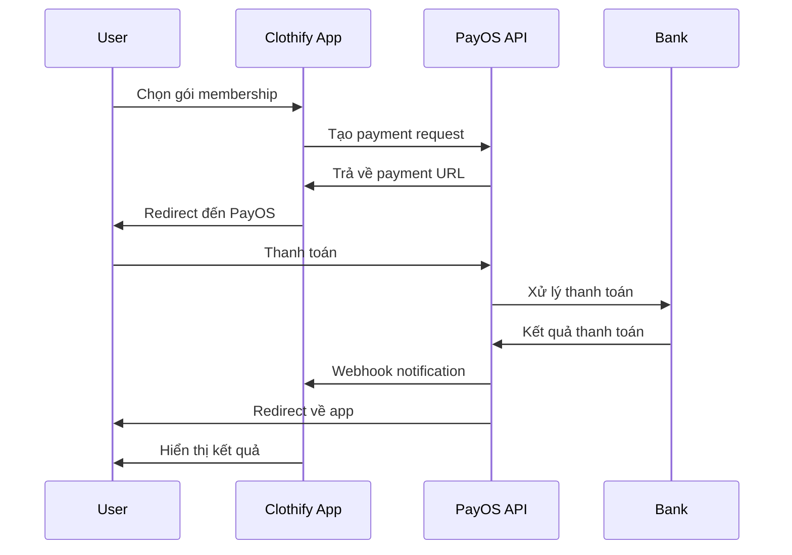

# PayOS Integration Setup Guide

## 🚀 Tích hợp PayOS vào Clothify

### 1. Đăng ký tài khoản PayOS

1. Truy cập [PayOS](https://payos.vn)
2. Đăng ký tài khoản doanh nghiệp
3. Xác thực tổ chức
4. Tạo kênh thanh toán mới

### 2. Lấy thông tin API

Sau khi tạo kênh thanh toán, bạn sẽ nhận được:
- **Client ID**: `x-client-id`
- **API Key**: `x-api-key` 
- **Checksum Key**: `x-signature`

### 3. Cấu hình Environment Variables

Thêm vào file `.env.local`:

```env
# PayOS Configuration
PAYOS_CLIENT_ID=your_payos_client_id
PAYOS_API_KEY=your_payos_api_key
PAYOS_CHECKSUM_KEY=your_payos_checksum_key

# App Configuration
NEXT_PUBLIC_APP_URL=http://localhost:3000
```

### 4. Cập nhật PayOS Config

Sửa file `src/lib/payos.ts`:

```typescript
export const PAYOS_CONFIG = {
  // ... existing config
  CLIENT_ID: process.env.PAYOS_CLIENT_ID!,
  API_KEY: process.env.PAYOS_API_KEY!,
  CHECKSUM_KEY: process.env.PAYOS_CHECKSUM_KEY!,
  // ... rest of config
}
```

### 5. Setup Database

Chạy SQL schema:

```sql
-- Chạy file database/payos-schema.sql trong Supabase SQL Editor
```

### 6. Cấu hình Webhook

1. Trong PayOS dashboard, cấu hình webhook URL:
   ```
   https://yourdomain.com/api/payment/payos/webhook
   ```

2. Để test local, sử dụng ngrok:
   ```bash
   ngrok http 3000
   ```

### 7. Test Integration

1. **Start server**:
   ```bash
   npm run dev
   ```

2. **Test payment flow**:
   - Đăng nhập vào Clothify
   - Vào trang Membership
   - Chọn gói và nhấn "Chọn gói"
   - Sẽ redirect đến PayOS

### 8. PayOS Payment Flow



### 9. API Endpoints

#### Tạo Payment
```
POST /api/payment/payos/create
```

#### Return URL
```
GET /api/payment/payos/return?orderCode=123&status=PAID
```

#### Webhook
```
POST /api/payment/payos/webhook
```

### 10. Troubleshooting

#### Lỗi thường gặp:

1. **"Invalid signature"**
   - Kiểm tra `CHECKSUM_KEY`
   - Đảm bảo data string được encode đúng

2. **"API error 401"**
   - Kiểm tra `CLIENT_ID` và `API_KEY`
   - Đảm bảo headers được set đúng

3. **"Order not found"**
   - Kiểm tra `orderCode` format
   - Đảm bảo order tồn tại trong PayOS

### 11. Production Checklist

- [ ] Cập nhật PayOS credentials production
- [ ] Cấu hình webhook URL production
- [ ] Test toàn bộ payment flow
- [ ] Setup monitoring và logging
- [ ] Backup database schema

### 12. So sánh với VNPay

| Tính năng | PayOS | VNPay |
|-----------|-------|-------|
| Tài khoản ảo | ✅ | ❌ |
| Tích hợp | ✅ Dễ | ⚠️ Phức tạp |
| Documentation | ✅ Tốt | ✅ Rất tốt |
| Community | ⚠️ Nhỏ | ✅ Lớn |
| Support | ✅ Tốt | ✅ Tốt |

**PayOS phù hợp cho:**
- Dự án nhỏ đến trung bình
- Cần tích hợp nhanh
- Muốn sử dụng tài khoản ảo
- Không cần quá nhiều tính năng phức tạp
